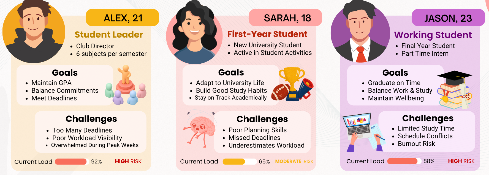
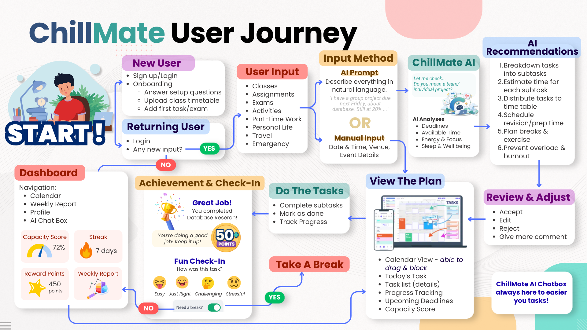
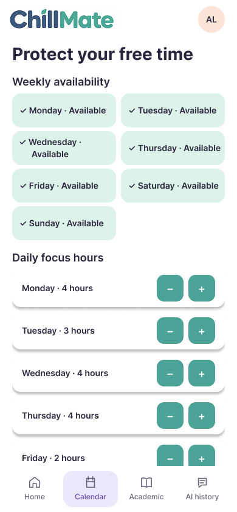
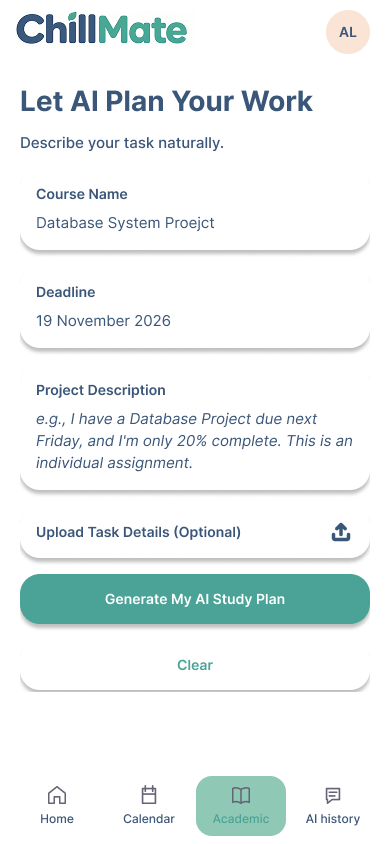
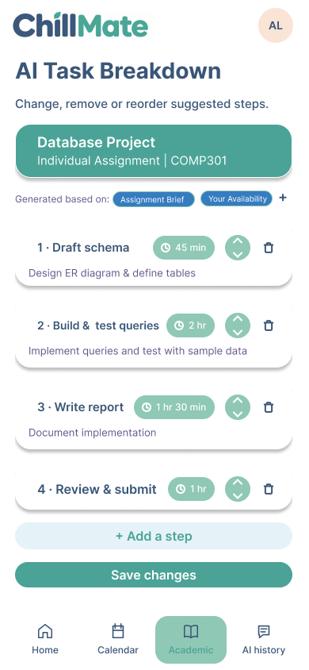
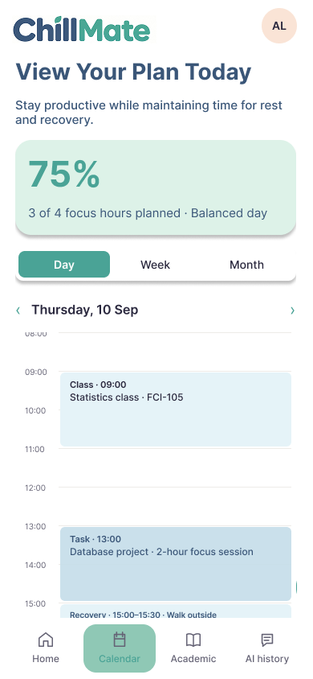
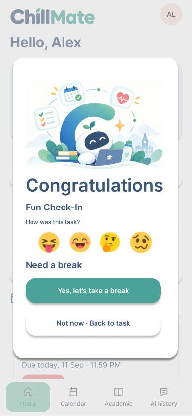
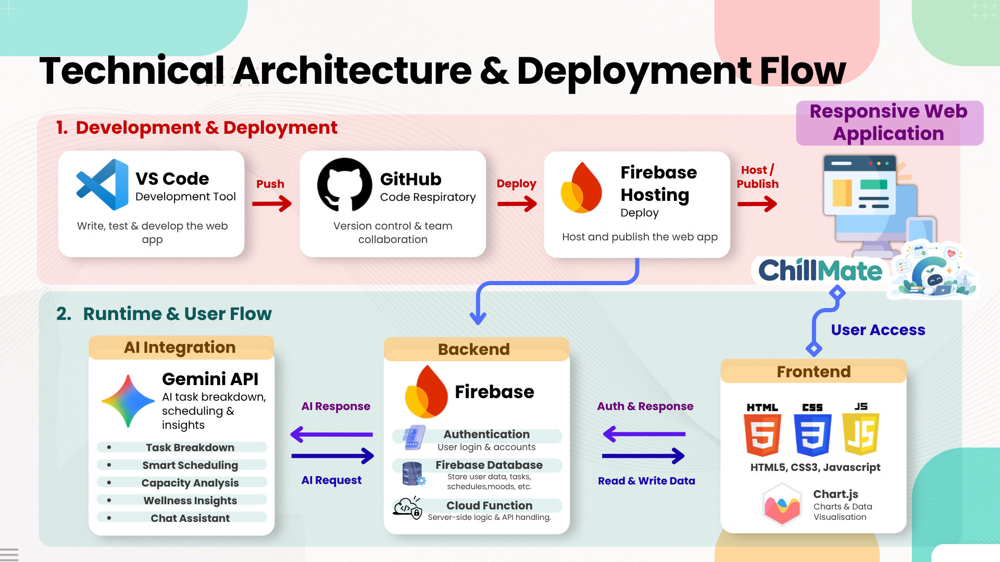
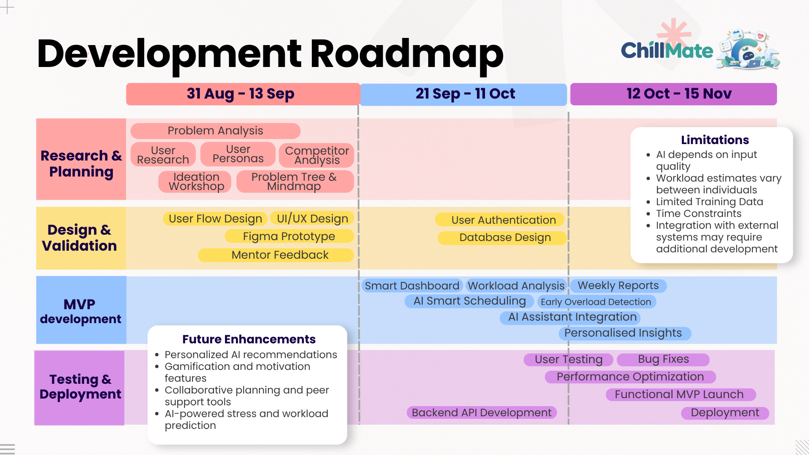

# ChillMate by One More Fix

### Your AI Buddy for Stress-Free Student Life

**Team:** One More Fix 

**Team Members:** Goh Xin Ni, Goh Yi Jun, Cheryl Goh Wen Si 

**Problem Statement:** Stress & Workload Manager 

**Video Presentation:** [Video](https://youtu.be/VnQxF0qPk0g)

**Presentation Slides:** [ChillMate Slidedesk](https://drive.google.com/file/d/1ncX-tmuxeyjPSKpPEny4pXMASWHywF3U/view?usp=drive_link)

---

# 1. Project Overview

## The Problem

University students face increasing levels of stress due to the combination of academic responsibilities, extracurricular commitments, part-time work, personal obligations, and social commitments. While numerous productivity tools exist, they primarily focus on managing tasks rather than understanding whether students have the capacity to realistically handle their workload.

Our team identified four major root causes:

- Fragmented tools requiring students to manually combine information across multiple platforms
- Multiple commitments competing for limited time, energy, and mental capacity
- Overcommitment caused by underestimating actual workload
- Competing priorities that make decision-making difficult

As a result, students often experience:

- Increased stress
- Reduced productivity
- Burnout risk
- Poor visibility of future workload
- Difficulty balancing academics and personal life

---

## Stakeholders & User Personas

ChillMate is designed for students managing academics, commitments, and wellbeing throughout their educational journey.

### Target Users

- Pre-University Students
- Undergraduate Students
- Postgraduate Students

### Representative User Personas

---

## Our Solution

### Your Personal AI-Powered Academic Planning Assistant

Imagine simply telling the system:

> "I have a Mathematics test next Friday, two assignments due next week, and I'm unavailable on Wednesday."

Within seconds, StudyFlow AI automatically understands your academic workload, prioritizes important tasks, breaks complex assignments into smaller milestones, and generates a personalized study timetable tailored specifically to you.

Unlike traditional study planners that only store information, **StudyFlow AI actively plans for students.**

### Why StudyFlow AI?

✅ Reduces academic procrastination

✅ Eliminates manual timetable planning

✅ Adapts instantly to schedule changes

✅ Creates personalized study plans

✅ Saves students valuable time

✅ Keeps students motivated through gamification

✅ Leverages AI to make smarter study decisions

---

## ✨ Key Features

<table>
<tr>

<td width="50%" valign="top">

### 🤖 AI Study Assistant

*Talk to your planner naturally.*

Simply describe your assignments, exams, deadlines, and commitments in everyday language. StudyFlow AI understands your workload, identifies priorities, and instantly transforms your input into an actionable study plan.

✅ Natural Language Input  
✅ Deadline & Priority Recognition  
✅ Personalized Study Recommendations  

</td>

<td width="50%" valign="top">

### 📚 AI Task Breakdown & Smart Scheduling

*Let AI handle the planning.*

Large assignments and exam preparations can feel overwhelming. StudyFlow AI automatically breaks complex tasks into manageable subtasks, estimates the required effort, and generates a personalized timetable tailored to your schedule.

✅ AI Task Breakdown  
✅ Effort & Time Estimation  
✅ AI-Powered Schedule Generation  

</td>

</tr>

<tr>

<td width="50%" valign="top">

### 📅 Smart Availability Management

*Your schedule adapts to real life.*

Students can mark specific days or time slots as available or unavailable. Whenever plans change, StudyFlow AI automatically reorganizes remaining tasks while keeping deadlines achievable.

✅ Available / Unavailable Day Settings  
✅ Automatic Schedule Adjustment  
✅ Personalized Time Allocation  

</td>

<td width="50%" valign="top">

### 📊 Progress & Productivity Dashboard

*See your academic journey at a glance.*

Monitor completed tasks, pending assignments, study progress, and upcoming deadlines through a centralized dashboard designed to provide clear visibility into your workload.

✅ Task Status Tracking  
✅ Progress Monitoring  
✅ Deadline Visibility  

</td>

</tr>

<tr>

<td width="50%" valign="top">

### 🎉 Achievement & Smart Check-In

*Stay motivated while building consistent habits.*

Celebrate milestones through achievements, study streaks, and progress rewards. Regular check-ins help students reflect on their workload while enabling the AI to improve future schedule recommendations.

✅ Achievement System  
✅ Study Streak Rewards  
✅ Workload Check-Ins  

</td>

<td width="50%" valign="top">

### 🚀 Adaptive Academic Planning

*An intelligent planner that evolves with you.*

Unlike traditional planners, StudyFlow AI continuously adapts based on task completion, availability changes, and workload adjustments to maintain realistic and achievable schedules throughout the semester.

✅ Dynamic Timetable Updates  
✅ Workload Balancing  
✅ Personalized Planning Experience  

</td>

</tr>
</table>

---

# 2. Ideation & Process

## 2.1 Ideas We Considered

During the ideation phase, our team explored multiple approaches to improve student productivity, academic planning, and workload management. After discussing the feasibility, uniqueness, and potential impact of each feature, we refined our scope to focus on AI-powered planning capabilities that provide the greatest value to students.

| Idea | Decision | Reason |
|--------|----------|----------|
| AI Study Assistant | ✅ Kept | Allows students to describe assignments, exams, and deadlines in natural language while the AI understands and organizes their workload automatically. |
| AI Task Breakdown | ✅ Kept | Breaks large assignments and exam preparation into manageable study sessions, reducing procrastination and planning effort. |
| AI Smart Scheduling | ✅ Kept | Automatically generates personalized study timetables based on deadlines, priorities, and availability. |
| Smart Availability Management | ✅ Kept | Enables students to mark available or unavailable days and allows the AI to adjust schedules accordingly. |
| Progress Tracking | ✅ Kept | Provides visibility into task completion and study progress, helping students stay on track throughout the semester. |
| Achievement & Smart Check-In | ✅ Kept | Encourages motivation and consistency through achievements, rewards, and workload reflection check-ins. |
| Workload Capacity Score | ⚠ Future Enhancement | Valuable for identifying overload levels and helping students better understand their workload capacity. |
| Recovery & Break Suggestions | ⚠ Future Enhancement | Useful for promoting healthy study habits and wellbeing after core scheduling features are completed. |
| Emergency Overload Mode | ⚠ Future Enhancement | Can help students manage unexpected situations by automatically reprioritizing tasks and schedules. |
| Stress & Burnout Detection | ⚠ Future Enhancement | Supports student wellbeing but requires additional data analysis beyond the MVP scope. |
| Sleep Tracking Integration | ⚠ Future Enhancement | Can provide additional insights into student wellness and workload balance but is not essential for the initial release. |
| Wellness Tracking Features | ⚠ Future Enhancement | Considered beneficial for long-term student wellbeing but secondary to academic planning capabilities. |
| Digital Diary / Reflection Journal | ❌ Dropped | Interesting feature, but not essential to solving the workload management problem. |
| Community & Social Features | ❌ Dropped | Reduced focus on general productivity features to prioritize AI-powered capabilities. |

### Final Decision

After evaluating all proposed ideas, our team decided to focus on an **AI-Powered Academic Planning Assistant** that helps students:

- 🤖 Understand and organize academic workload through AI.
- 📚 Break down assignments into manageable tasks.
- ⚡ Generate personalized study schedules automatically.
- 📅 Adapt plans when availability changes.
- 📈 Track progress toward academic goals.
- 🎉 Stay motivated through achievements and regular check-ins.

By concentrating on these AI-driven features, the solution moves beyond traditional task management tools and provides a personalized planning experience that actively helps students make better academic decisions.

---

## 2.2 Ideation Boards

Throughout the ideation phase, our team explored multiple approaches to solving student stress and workload management. This included identifying root causes, defining user personas, analysing existing solutions, mapping user journeys, and evaluating potential AI-powered features.

### Miro Ideation Board

🔗 **Miro Board:**
[Miro Ideation Board](https://miro.com/app/board/uXjVHoritp0=/?share_link_id=862469720840)

This board contains our brainstorming process, feature exploration, user journey mapping, problem analysis, competitor research, and concept evolution throughout the prototype phase.

---

### User Journey

This journey map illustrates how students interact with ChillMate, from task input and AI analysis to personalized scheduling, execution, wellbeing support, and achievement tracking.

---

## 2.3 Mentor Consultation

Throughout the project, we regularly sought feedback from our mentor to validate our problem framing, feature prioritization, and overall solution direction.

### Strengths Identified

| Feedback | Action Taken |
|-----------|-------------|
| Clear framing of the problem before introducing the solution. | Retained the problem-driven structure of the presentation and README. |
| Strong storytelling in the final pitch. | Continued focusing on a user journey that demonstrates how students interact with the system. |
| The AI-related use cases were the most compelling aspects of the project. | Positioned AI-powered features as the core value proposition of the solution. |

### Recommendations from Mentor

| Recommendation | Action Taken |
|---------------|-------------|
| Emphasize the unique differentiating features of the product. | Highlighted AI Study Assistant, AI Task Breakdown, AI Smart Scheduling, and Adaptive Planning as the primary features. |
| Prioritize special AI-powered capabilities over standard productivity functions. | Reduced focus on generic planner functionalities and emphasized intelligent automation. |
| Showcase how AI helps students make decisions rather than simply record information. | Refined the product positioning as an AI-powered academic planning assistant rather than a traditional task management application. |
| Streamline the presentation around what makes the solution unique. | Simplified feature prioritization and focused the narrative on the AI planning workflow. |

### Impact on Final Solution

Based on the mentor's feedback, the project evolved from a broad student productivity platform into a more focused **AI-Powered Academic Planning Assistant**.

Several secondary features such as workload analysis, burnout detection, recovery suggestions, and wellness tracking were moved into future enhancement considerations to ensure the MVP remains focused, impactful, and aligned with the project's core objective.

---

# 3. Design & Prototype

### UI Prototype

🔗 **Figma Prototype:**
[Figma Link](https://www.figma.com/design/qknnO42d6HyZV5MuY57mEp/CodeNection?m=auto&t=sKJHjhlCKaDEAvsm-1)
[Figma Prototype Link](https://www.figma.com/proto/qknnO42d6HyZV5MuY57mEp/CodeNection?node-id=0-1&t=9IzO7p1A2U5rtvQY-1)

The following screens demonstrate the end-to-end user journey within ChillMate, from setting availability and adding commitments to receiving AI-powered recommendations and tracking progress.

<table>
<tr>
<td width="40%">

</td>
<td width="60%">

<h3>1. Setup & Availability Management</h3>

<b>Key Interactions</b>

<ul>
<li>Update class timetable</li>
<li>Mark specific days as available or unavailable</li>
<li>Configure personal study capacity and focus hours</li>
</ul>

<b>Purpose</b>

Allows ChillMate to generate realistic schedules based on the student's actual availability instead of assuming they are free every day.

</td>
</tr>

<tr>
<td width="40%">

</td>
<td width="60%">

<h3>2. AI Prompt Input</h3>

<b>Key Interactions</b>

<ul>
<li>Describe tasks using natural language</li>
<li>Provide deadlines and task details</li>
<li>Receive AI follow-up questions when information is incomplete</li>
</ul>

<b>Purpose</b>

Transforms workload planning into a simple conversation while collecting sufficient information for personalized recommendations.

</td>
</tr>

<tr>
<td width="40%">

</td>
<td width="60%">

<h3>3. AI Task & Time Breakdown</h3>

<b>Key Interactions</b>

<ul>
<li>Generate actionable subtasks</li>
<li>Estimate time required for each task</li>
<li>Create a structured work plan</li>
</ul>

<b>Purpose</b>

Breaks large assignments into manageable steps, helping students reduce procrastination and start tasks earlier with a clear plan.

</td>
</tr>

<tr>
<td width="40%">

</td>
<td width="60%">

<h3>4. Smart Timetable & Calendar View</h3>

<b>Key Interactions</b>

<ul>
<li>View AI-generated schedules</li>
<li>Review workload distribution</li>
<li>Monitor upcoming deadlines and commitments</li>
</ul>

<b>Purpose</b>

Provides a unified view of academics, activities, and personal commitments, allowing students to identify overloaded periods before they become stressful.

</td>
</tr>

<tr>
<td width="40%">

</td>
<td width="60%">

<h3>5. Progress Tracking, Achievement & Wellbeing Support</h3>

<b>Key Interactions</b>

<ul>
<li>Update task status and progress</li>
<li>Track assignment completion</li>
<li>Receive achievement rewards</li>
<li>Complete quick wellbeing check-ins</li>
<li>Receive recovery and break recommendations</li>
</ul>

<b>Purpose</b>

Encourages healthy study habits through positive reinforcement while continuously supporting student wellbeing.

</td>
</tr>
</table>

---

# 4. What Makes It Different

## Existing Solutions & Market Gap

Current productivity and academic planning tools such as Google Calendar, Notion, MyStudyLife, and Todoist provide useful scheduling and task management features. However, these platforms primarily act as digital record-keeping tools, requiring users to manually organize tasks, determine priorities, estimate workloads, and create their own schedules.

| Feature | MyStudyLife | Todoist | Mood Tracker | Studwy | ChillMate |
|----------|------------|----------|-------------|---------|----------|
| Academic Planning | ✅ | ❌ | ❌ | ✅ | ✅ |
| Task Management | ✅ | ✅ | ❌ | ✅ | ✅ |
| AI Task Breakdown | ❌ | ❌ | ❌ | ✅ | ✅ |
| Workload Capacity Score | ❌ | ❌ | ❌ | ❌ | ✅ |
| Stress Monitoring | ❌ | ❌ | ✅ | ❌ | ✅ |
| Wellbeing & Life Balance | ❌ | ❌ | ✅ | Limited | ✅ |
| Weekly Workload Analysis | ❌ | ❌ | ❌ | ❌ | ✅ |

### Market Gap

Although current solutions help students organize information, they rarely help students answer important planning questions:

- What should I study first?
- How much time should I allocate to each task?
- How can my study plan adapt when my schedule changes?
- How can large assignments be broken into manageable steps?

Furthermore, the rise of Generative AI has significantly changed user expectations. AI is increasingly being integrated into everyday workflows to automate repetitive tasks, improve productivity, save time, and provide personalized recommendations. 

Yet, most academic planning applications have not fully leveraged AI to support personalized scheduling, workload management, and decision-making.

This creates a clear opportunity for an AI-powered academic planning assistant that goes beyond organizing information and actively helps students plan, adapt, and succeed.

---

## 🌟 What Makes ChillMate StudyFlow AI Different?

Most study planning applications help students **record tasks**.

**ChillMate StudyFlow AI helps students make decisions.**

Instead of manually planning every assignment and exam, students only need to provide:

- Their academic workload
- Assignment deadlines
- Examination dates
- Personal availability

The AI then automatically:

1. Understands academic requirements.
2. Prioritizes urgent and important tasks.
3. Breaks complex work into manageable sessions.
4. Generates a personalized timetable.
5. Adapts to schedule changes automatically.
6. Tracks progress and motivates consistency.

### From Overwhelmed ➜ Organized

ChillMate StudyFlow AI transforms academic planning from a tedious manual process into an intelligent, personalized, and adaptive learning experience powered by AI.

---

# 5. Technical Architecture & Feasibility

## Tech Stack

| Layer | Technology | Reason |
|---------|------------|----------|
| Frontend | HTML5, CSS3, JavaScript | Lightweight and accessible |
| Backend | Firebase Cloud Functions | Serverless architecture |
| Database | Firebase Firestore | Real-time cloud database |
| Authentication | Firebase Authentication | User management |
| AI | Gemini API | Task breakdown and scheduling |
| Visualization | Chart.js | Workload analysis and charts |
| Hosting | Firebase Hosting | Fast and scalable deployment |

---

## Technical Architecture

The system consists of:

- Responsive Web Application
- Firebase Backend
- Gemini AI Integration
- Cloud-Based Deployment

---

### Development Roadmap

This roadmap outlines the project's phases, MVP scope, future enhancements, and expected deliverables.

### 🚀 Future Enhancements

| Enhancement | Description |
|------------|-------------|
| 😴 **Sleep Tracking & Wellness Suggestions** | Monitor sleep patterns and provide wellness, recovery, and study-life balance recommendations. |
| 📥 **Automatic Timetable Import** | Import class schedules directly from university timetables and academic calendars to reduce manual setup. |
| 🤖 **Advanced AI Recommendations** | Provide smarter workload predictions, personalized study strategies, and adaptive learning recommendations. |
| 📱 **Mobile Quick Capture Companion App** | Allow students to quickly record tasks, deadlines, and reminders on the go. |
| 🎮 **Enhanced Gamification Features** | Expand the achievement system with study streaks, badges, rewards, and motivational challenges. |
| 👥 **Collaborative Planning** | Support group projects, shared deadlines, and collaborative study planning among classmates. |
| 📊 **Workload Capacity & Burnout Analysis** | Introduce workload capacity scoring, overload detection, and burnout risk indicators. |

---

## Scalability

StudyFlow AI is designed with scalability in mind. While the MVP focuses on university students, the platform can be adapted to support a wider range of users with different planning and productivity needs. This enables long-term growth opportunities and expands the potential impact of the solution beyond a single target audience.

---
